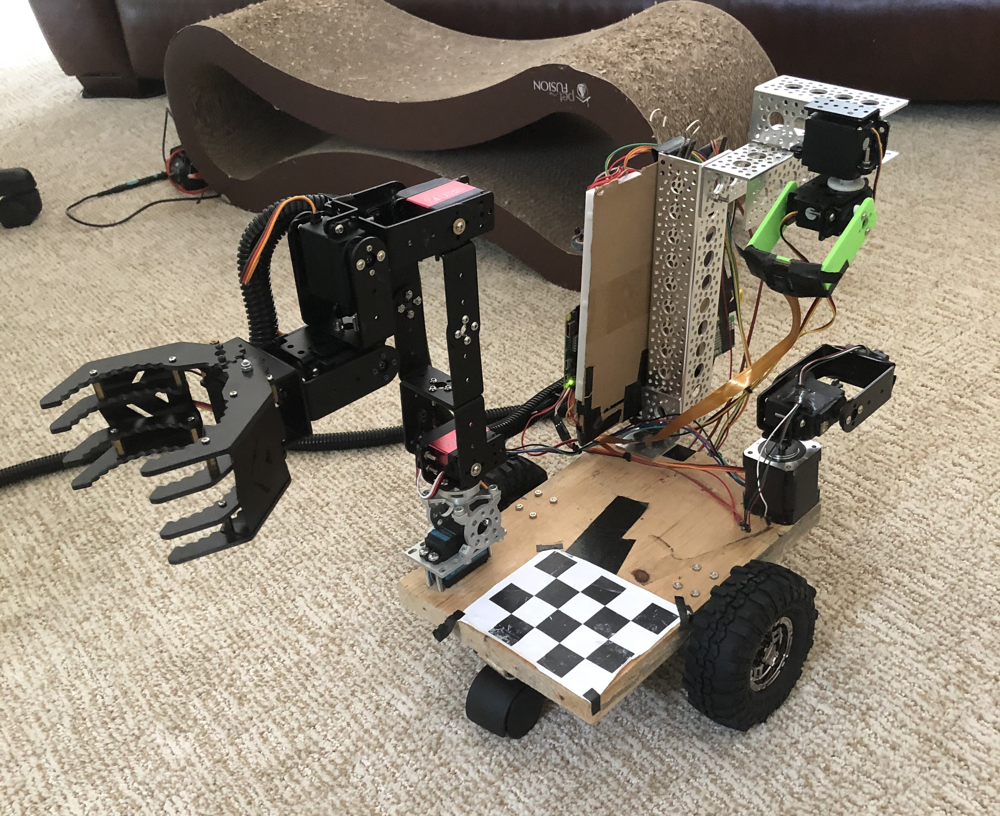

# Robot-Rover

Autonomous, robotic rover and arm controlled with computer vision and SLAM algorithms.

The arm consists of 6 servo motors and a camera, which are controlled with a raspberry pi zero W.
- Using a convolutional neural network, the position of objects visible to the camera is estimated
- The arm raspeberry pi then evaluates an inverse kinematics algorithm move the arm and pick up objects detected by the camera  
- See more details about the robot arm [here](https://github.com/abobco/Robot-Arm)

The rover is driven by 2 DC motors, 2 quadrature rotary encoders, a TFMini lidar sensor, and pan/tilt servos to rotate the camera, which are all controlled by an ESP32 microcontroller. 

Basic steps of the rover's navigation/localization algorithm

1. A lidar scan of the area around the rover is performed by rotating the lidar sensor in small steps, storing its angle and distance measurement at each step. 
2. Each distance measurement is then treated as a 3D vector pointing straight forward, and rotated by the sensor's angle at the time of measurement to form a 3D pointcloud of the area around the rover.
3. This pointcloud is then converted into a coarser resolution, 2D grid representing a topdown map of the area. This is done with a simple "marching squares" algorithm. 
    - This map defines the areas that are accessible to the rover
4. This map is sent to a windows laptop to be displayed in a desktop application 
5. The application user can click on a square of the map to automatically solve for a path to that square and send instructions to the rover to move along that path
    - Pathfinding is implemented with the A* algorithm, using manhattan distance as a cost function

To perform error and drift correction, multiple lidar scans are performed as the rover moves along a path. I implemented a simple "hill-climbing" algorithm to correct the error between subsequent lidar scans down to a local minimum. Here's a basic overview of that algorithm

1. For each point in a new scan, the distance to the closest point in the previous scan is calculated
2. The average of these closest-point distances is calculated
3. Each point in the new scan is then rotated around the rover by a small amount 
4.  Repeat steps 5.1-5.3 until the average distance stops decreasing between rotations
5.  Repeat steps 5.1-5.4, rotating in the opposite direction 
6.  Repeat steps 5.1-5.5 with linear transformations in the x and y axes instead of rotations

Note that this algorithm makes the assumption that there will always be some shared points between 2 subsequent lidar scans. If the scans do not share any points, it will blindly solve for some incorrect transformation that makes the scans overlap!

## Pictures/videos

Robot Arm prototype

Desktop application

